# Training-Free Novel Object Detection using Mahalanobis Semantic Alignment and Hybrid Optimal Transport Fusion

[Muhammad Faraz](https://github.com/kkfaraz), [Hassan Rasheed](https://github.com), [Muhammad Haseeb Butt](https://github.com), [Mamoon Abbas](https://github.com)  
*Department of Data Science, GIFT University, Gujranwala, Pakistan*  
*Supervisor: Sir Usman Ali*

Official implementation of our paper "Training-Free Novel Object Detection using Mahalanobis Semantic Alignment and Hybrid Optimal Transport Fusion".

<hr>

> **Abstract:** *Traditional object detection systems operate under the closed-set assumption, recognizing only a fixed set of categories seen during training and treating everything else as background. This constraint severely limits their reliability in real-world settings autonomous driving, surveillance, and safety-critical monitoring where novel and rare objects appear frequently. We present an improved training-free Novel Object Detection (NOD) framework that transforms closed-set detectors into open-set detectors through cooperative integration of frozen foundational models.
> 
> Our pipeline operates in three stages. In the initialization stage, Mask R-CNN and Grounding DINO generate complementary region proposals, capturing both known-class detections and candidate novel regions. In the unknown object labeling stage, a Vision-Language Reasoning Model (VLRM) generates prompt-independent captions for background proposals, and CLIP assigns semantic labels using **Mahalanobis distance** replacing conventional cosine similarity to leverage distributional information from multi-template text embeddings for more discriminative class separation. In the refinement stage, we introduce a **Hybrid Matching method based on Optimal Transport and Hungarian matching** that replaces the baseline Sinkhorn-based fusion, followed by SAM-based mask refinement and a Score Reliability Module (SRM) for confidence recalibration.
> 
> We evaluate the proposed approach on LVIS v1.0 and COCO Open-Vocabulary Detection (OVD) benchmarks. On COCO-OVD, the improved framework achieves an AP of 40.72 and AP50 of 56.40 on unseen categories a gain of +6.40 AP50 over the baseline pipeline using cosine similarity and simple concatenation while maintaining a strong overall AP of 37.35 across all 65 categories. On the challenging LVIS v1.0 benchmark with 1,203 categories, the framework achieves mAP[@.5:.95] of 15.77 and 13.72 AP on novel classes, with 40.25 AP on known categories, demonstrating consistent improvements in novel object recall and localization accuracy over traditional baselines. Due to its modular design and reliance on frozen pre-trained models, the framework remains computationally efficient and easily extensible to new object categories without retraining.*

## :trophy: Achievements and Features

- We establish **state-of-the-art results (SOTA)** in novel object detection on LVIS, and open-vocabulary detection benchmark on COCO.
- We propose a simple, modular, and training-free approach which can detect (i.e. localize and classify) known as well as novel objects in the given input image.
- Our approach easily transforms any existing closed-set detectors into open-set detectors by leveraging the complimentary strengths of foundational models like CLIP and SAM.
- We introduce **Mahalanobis Semantic Alignment** for robust classification and **Hybrid OT + Hungarian Matching** for conflict-free detection fusion.
- The modular nature of our approach allows us to easily swap out any specific component, and further combine it with existing SOTA open-set detectors to achieve additional performance improvements.

## :hammer_and_wrench: Setup and Installation
We have used `python=3.8.15`, and `torch=1.10.1` for all the code in this repository. It is recommended to follow the below steps and setup your conda environment in the same way to replicate the results.

1. Clone this repository into your local machine as follows:
```bash
git clone https://github.com/kkfaraz/fyp-novel-object-detection.git
```
2. Change the current directory to the main project folder:
```bash
cd fyp-novel-object-detection
```
3. To install the project dependencies and libraries, use conda and install the defined environment from the .yml file by running:
```bash
conda env create -f environment.yml
```
4. Activate the newly created conda environment:
```bash
conda activate coop_foundation_models 
```
5. Install the Detectron2 v0.6 library via pip:
```bash
python -m pip install detectron2 -f https://dl.fbaipublicfiles.com/detectron2/wheels/cu113/torch1.10/index.html
```

### Datasets
To download and setup the required datasets used in this work, please follow these steps:
1. Download the COCO2017 dataset from their official website: [https://cocodataset.org/#download](https://cocodataset.org/#download). Specfically, download `2017 Train images`, `2017 Val images`, `2017 Test images`, and their annotation files `2017 Train/Val annotations`.
2. Download the LVIS v1.0 annotations from: [https://www.lvisdataset.org/dataset](https://www.lvisdataset.org/dataset). There is no need to download images from this website as LVIS uses the same COCO2017 images. Specifically download the annotation files corresponding to the training set (1GB), and validation set (192 MB).
3. Download extra/custom annotation files for COCO open-vocabulary splits from: [COCO-OVD-Annotations](https://mbzuaiac-my.sharepoint.com/:f:/g/personal/rohit_bharadwaj_mbzuai_ac_ae/EgiIumWrcqhGpanKRaYfGYsBOga7V4fgDHcz_W_ys8UVLg?e=Qq0gfT), specifically download both `ovd_instances_train2017_base.json`, and `ovd_instances_val2017_basetarget.json`.
4. Download extra/custom annotation file for `lvis_val_subset` dataset from: [LVIS-Val-Subset](https://mbzuaiac-my.sharepoint.com/:f:/g/personal/rohit_bharadwaj_mbzuai_ac_ae/ErCHDEIltBNBpnedS2S0TUsBFHs1SmVTM525z6ukoiMFLw?e=QPBEL0), specifically download `lvis_v1_val_subset.json`.
5. Detectron2 requires you to setup the datasets in a specific folder format/structure, for that it uses the environment variable `DETECTRON2_DATASETS` which is set equal to the path of the location containing all the different datasets. The file structure of `DETECTRON2_DATASETS` should be as follows:
- `coco/`
  - `annotations/`
    - `instances_train2017.json`
    - `instances_val2017.json`
    - `ovd_instances_train2017_base.json`
    - `ovd_instances_val2017_basetarget.json`
  - `train2017/`
  - `val2017/`
  - `test2017/`
- `lvis/`
  - `lvis_v1_val.json`
  - `lvis_v1_train.json`
  - `lvis_v1_val_subset.json`

The value for `DETECTRON2_DATASETS` or `detectron2_dir` in our code file should be the absolute path to the `datasets` directory which follows the above structure.

### Model Weights
All the pre-trained model weights can be downloaded and placed inside the repository:
- **GDINO_weights.pth**: Grounding DINO model weights used in both Novel Object Detection, and Open Vocabulary Detection tasks.
- **SAM_weights.pth**: Segment Anything Model (SAM) weights.
- **maskrcnn_v2**: Folder containing the weights of trained Mask-RCNN V2 model on COCO dataset.
- **moco_v2_800ep_pretrain.pkl**: Initial pre-trained checkpoint for Mask-RCNN.
- **MaskRCNN_COCO_OVD**: Folder containing the weights of trained Mask-RCNN model on COCO OVD data split.

---

## 🔎 Novel Object Detection on LVIS Val Dataset

| Method | Mask-RCNN | GDINO | VLM | Novel AP | Known AP | All AP |
|---|---|---|---|---|---|---|
| K-Means | - | - | - | 0.20 | 17.77 | 1.55 |
| Weng et al | - | - | - | 0.27 | 17.85 | 1.62 |
| ORCA | - | - | - | 0.49 | 20.57 | 2.03 |
| UNO | - | - | - | 0.61 | 21.09 | 2.18 |
| RNCDL | V1 | - | - | 5.42 | 25.00 | 6.92 |
| GDINO | - | ✔ | - | 13.47 | 37.13 | 15.30 |
| Ours | V2 | ✔ | SigLIP | 15.42 | 46.08 | 18.26 |
| Ours | V2 | ✔ | SigLIP | 16.82 | 55.08 | 21.53 |
| Base | V2 | ✔ | SigLIP | 17.42 | 42.08 | 19.33 |

**Table 1:** Comparison of object detection performance using mAP on the *lvis_val* dataset.

To replicate the Novel Object Detection results:
1. Modify `scripts/novel_object_detection/params.json` to configure paths for weights and datasets.
2. Run the main script:
   ```bash
   python scripts/novel_object_detection/main.py
   ```

---

## 🎖️ Open Vocabulary Detection on COCO OVD Dataset

| Method | Backbone | Use Extra Training Set | Novel AP50 |
|---|---|---|---|
| OVR-CNN | RN50 | ✔ | 22.8 |
| ViLD | ViT-B/32 | ✘ | 27.6 |
| Detic | RN50 | ✔ | 27.8 |
| OV-DETR | ViT-B/32 | ✘ | 29.4 |
| BARON | RN50 | ✘ | 34 |
| Rasheed et al | RN50 | ✔ | 36.6 |
| CORA | RN50x4 | ✘ | 41.7 |
| BARON | RN50 | ✔ | 42.7 |
| CORA+ | RN50x4 | ✔ | 43.1 |
| Base* | RN101 + SwinT | ✘ | 50.3 |
| Ours* | RN101 + SwinT | ✘ | 53.5 |
| Ours* | RN101 + SwinT | ✘ | 54.4 |
| Ours* | RN101 + SwinT | ✘ | 56.6 |

**Table 2:** Results on COCO OVD benchmark.
\*Our approach with GDINO, SigLIP, and Mask-RCNN trained on COCO OVD split.

To replicate the Open Vocabulary Detection results:
1. Run the evaluation script:
   ```bash
   python scripts/open_vocab_detection/evaluate_method/main.py
   ```

---

## :framed_picture: Qualitative Visualization
| RNCDL                                         | GDINO                                         | RCNN_CLIP                                | Ours                                         |
|-----------------------------------------------|-----------------------------------------------|-----------------------------------------------|----------------------------------------------|
| 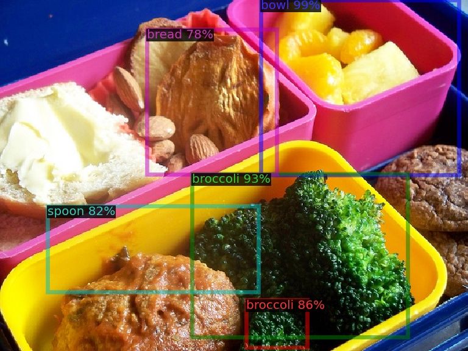 | 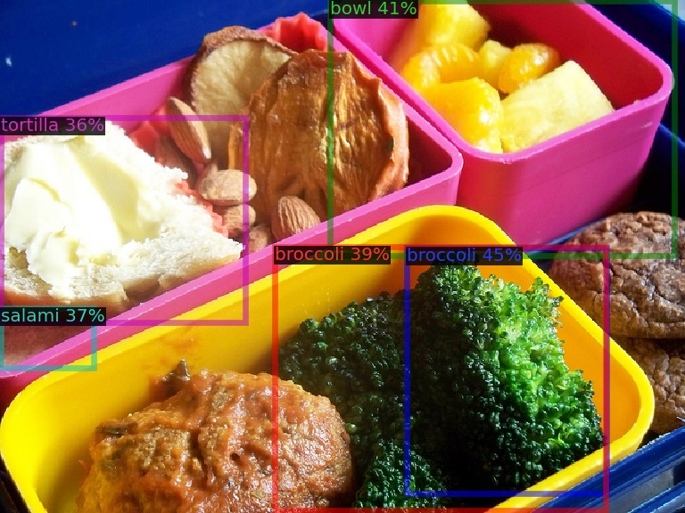 | 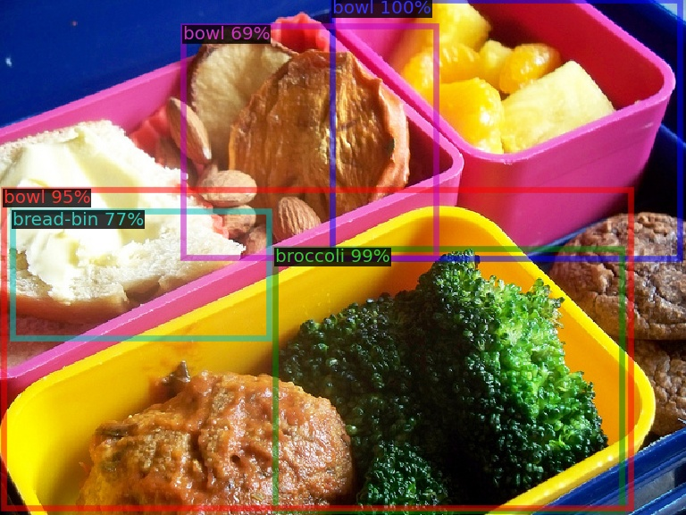 | 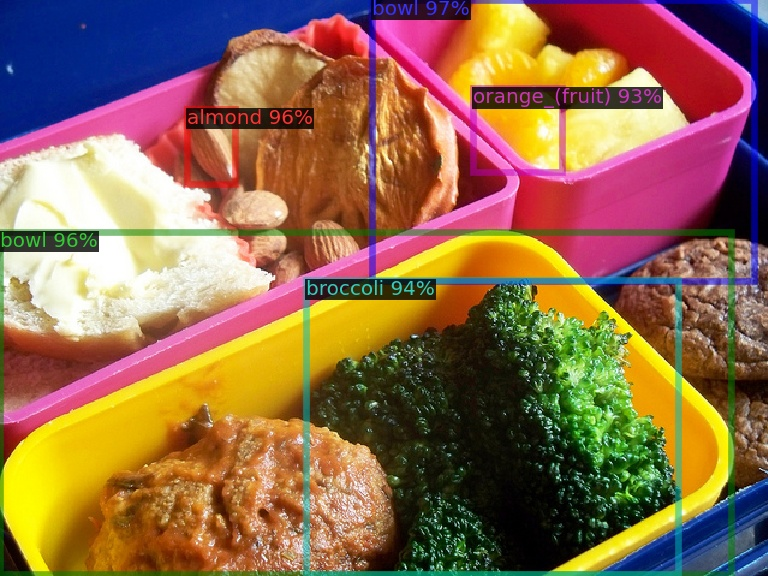 |
| 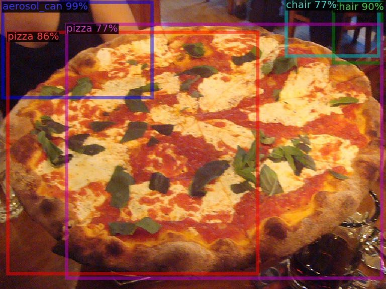 | 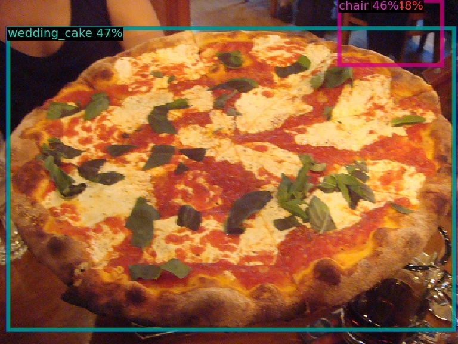 | 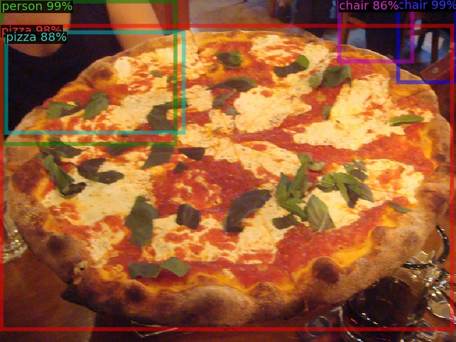 | 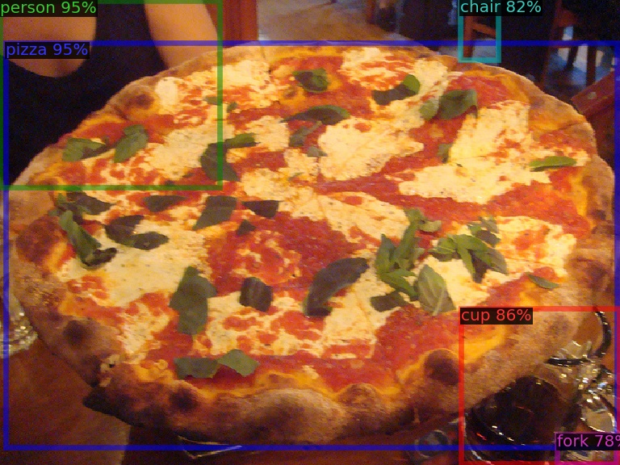 |
| 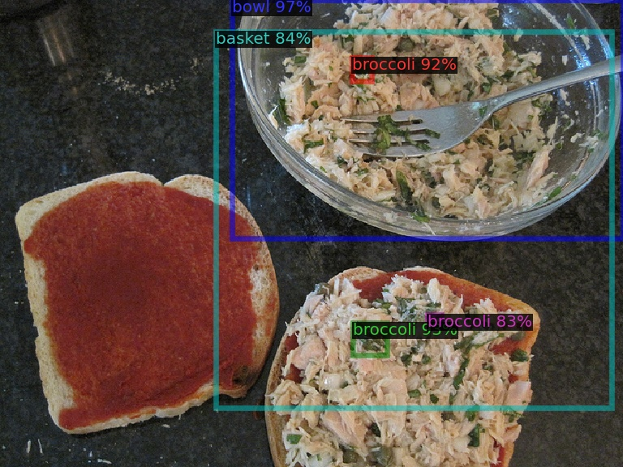 | 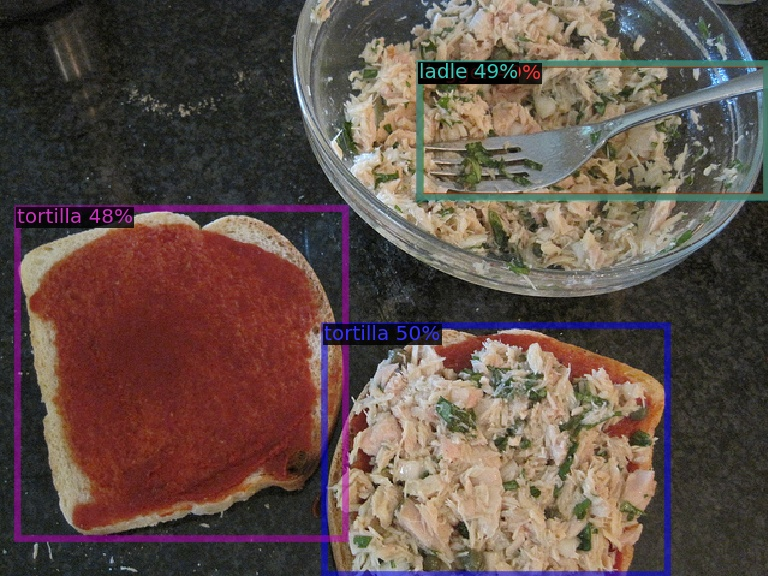 | 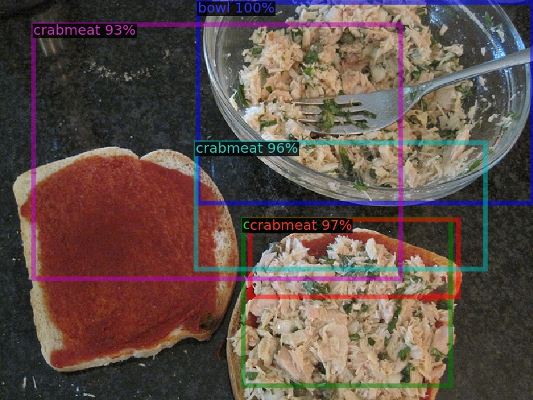 | 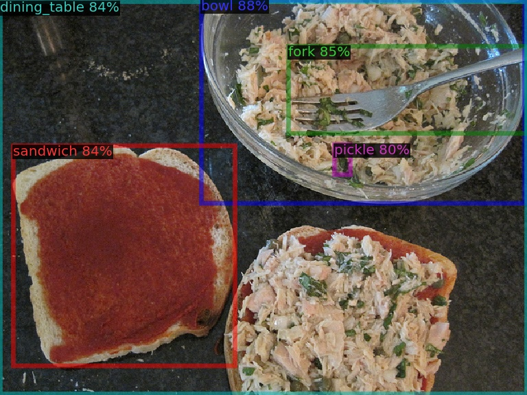 |


## :email: Contact
Should you have any questions, please create an issue in this repository or contact the authors.

## :black_nib: Citation
If you found our work helpful, please consider starring the repository ⭐⭐⭐ and citing our work as follows:
```bibtex
@InProceedings{Faraz_2026_NOD,
    author    = {Faraz, Muhammad and Rasheed, Hassan and Butt, Muhammad Haseeb and Abbas, Mamoon},
    title     = {Training-Free Novel Object Detection using Mahalanobis Semantic Alignment and Hybrid Optimal Transport Fusion},
    booktitle = {Proceedings of the Winter Conference on Applications of Computer Vision (WACV)},
    year      = {2026}
}
```

## :pray: Acknowledgement
We thank the authors of GDINO, SAM, CLIP, and RNCDL for releasing their codebases.
